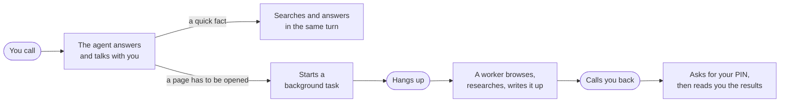
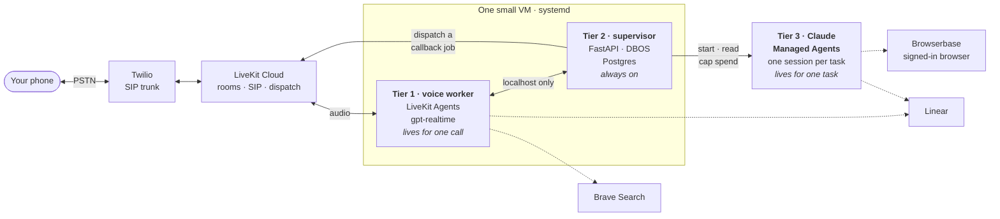
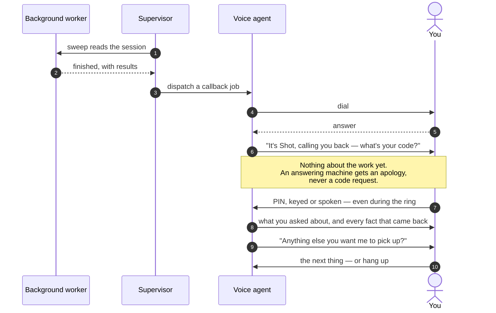

# shot

**A phone number you can call.** An agent answers, talks with you, hands long
work to a background worker, hangs up — and calls you back when it's done.




## What it does

- **Talks like a person** on a real phone line — interruptible, short turns, no
  reading out URLs or markdown.
- **Answers quick questions itself** — weather, scores, opening hours — with a
  web search inside the same turn.
- **Delegates anything that needs a page opened** — a schedule, a menu, a
  booking, an account — to a background worker with a real, signed-in browser.
- **Calls you back** when the work finishes, checks it's you, and reads every
  fact that came back. Then it stays on the line in case you have the next thing.
- **Knows your day** — one question covers your Linear tickets and its own
  background work; it can look up, write and comment on tickets by voice.
- **Remembers across calls** — the next time you ring, it leads with whatever
  finished that you haven't heard yet.

## How it's built

Three tiers, split by **how long each one lives**. A voice job dies with its
call and a worker session can't keep a timer, so neither can be the thing that
remembers — which is why there is a supervisor in the middle.



| Tier | Lives | Owns |
|---|---|---|
| **Voice worker** (`packages/voice`) | one call | the conversation, the PIN, the callback flow |
| **Supervisor** (`packages/supervisor`) | always | the task registry, durable timers, exactly-once callbacks |
| **Worker session** (Claude Managed Agents) | one task | the actual work: browsing, research, writing |

## The callback

The whole design hangs on one ordering: **nothing about the work is said until
the PIN checks out.** Caller ID proves nothing about who picked up.



## Guardrails

| | |
|---|---|
| **PIN before any detail** | Outbound calls always ask, under every setting. |
| **Machines never hear the work** | Answering-machine detection gates disclosure, and it fails closed. |
| **Nothing redials** | A missed callback waits — you hear it on your next call. |
| **Only you cancel** | Nothing stops your work on its own judgement. |
| **Spend is capped** | Every worker session has a hard budget (`SESSION_BUDGET_CENTS`). |
| **Exactly one callback** | Four independent guards; three paths can fire it, one wins. |

## Quick start

You'll need accounts with **Twilio** (a number and an Elastic SIP trunk),
**LiveKit Cloud**, **OpenAI**, **Deepgram**, **Anthropic**, **Browserbase** and
**Brave Search**. **Linear** is optional. Every key is explained in
[`.env.example`](.env.example).

```bash
cp .env.example .env                 # fill it in
uv sync

docker run -d --name shot-pg -p 5433:5432 \
  -e POSTGRES_PASSWORD=shot -e POSTGRES_DB=shot postgres:17

uv run python -m ops.bootstrap.db             # schema + owner row
uv run python -m ops.bootstrap.livekit_sip    # SIP trunks + dispatch rule
uv run python -m ops.bootstrap.anthropic_res  # worker agent, environment, vault, memory

set -a && . ./.env && set +a
uv run uvicorn shot_supervisor.app:app --host 127.0.0.1 --port 8090 &
uv run python -m shot_voice.worker dev &
```

Then call your number. `uv run python -m ops.status` checks every tier and
external dependency, read-only. In production both tiers run on one VM under
systemd — see [`RUNBOOK.md`](RUNBOOK.md).

### Tests

With a filled-in `.env`:

```bash
docker exec shot-pg createdb -U postgres shot_test   # once, for the DB-backed tests
uv run pytest -m "not contract"                      # offline, no network, ~8s
uv run --with websockets pytest                      # + live-API tests, ~4 min, cents
```

The callback path, including real DTMF, is covered offline with no room at all.
The live lane runs the real model in text mode against mocked tools.

## Layout

```
packages/
  core/         settings, clock, every timeout (budget.py), schema
  voice/        tier 1 — the LiveKit worker, prompts, tools, PIN, callback flow
  supervisor/   tier 2 — task registry, callbacks, approvals, cross-call memory
  hooks/        webhook receiver (placeholder; a sweep covers correctness)
ops/            bootstrap, deploy, status, call and transcript readers
tests/          offline by default; -m contract hits live APIs for cents
```

## Further reading

- [`RUNBOOK.md`](RUNBOOK.md) — running and operating it.
- [`MANUAL_E2E.md`](MANUAL_E2E.md) — the five checks only a real phone can do.
